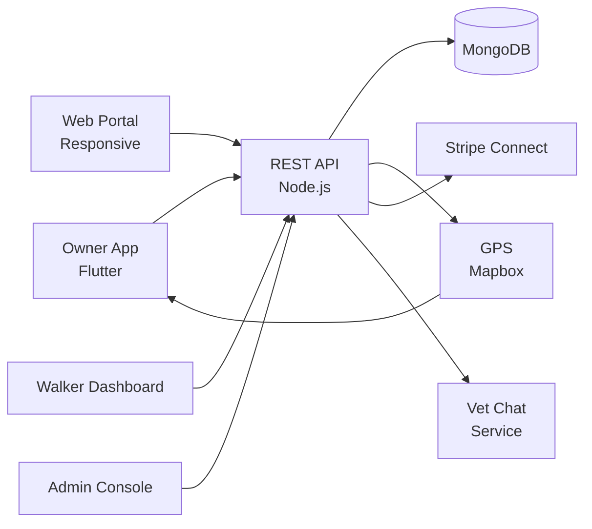

# Rover Clone — White-Label Pet Care Service Marketplace Platform by Miracuves

**MXRover** is a production-ready, white-label Rover clone: a complete pet-care service marketplace with owner, walker, and admin panels — delivered with **100% source code ownership** in **6 working days**.

> 🐾 **See it running before you talk to anyone.** Live owner app, walker dashboard, and admin console — demo credentials are printed on the [solution page](https://miracuves.com/rover-clone#demo). No sales call required.

---

## 🚀 Live Demos

| Environment | URL | What you can test |
|---|---|---|
| 📱 Owner App | [mas.mimeld.com](https://mas.mimeld.com) | Book walk, sit, board, vet chat |
| 🌐 Web Portal | [mxrover.mimeld.com](https://mxrover.mimeld.com) | Full pet-care experience in browser |
| 🐕 Walker Dashboard | [Solution page → Demo](https://miracuves.com/rover-clone#demo) | Bookings, walks, photos, payouts |
| 🛠️ Admin Console | [Solution page → Demo](https://miracuves.com/rover-clone#demo) | Walkers, services, regions, analytics |

Demo credentials for all environments: **[miracuves.com/rover-clone → Demo section](https://miracuves.com/rover-clone/#demo)**

---

## ✨ What Makes This Rover Clone Different

Most pet-care scripts stop at "search a walker." This platform ships with the features that actually run a pet-care *business*:

- **Background-Checked Walkers** — ID + background check on every walker — what pet owners actually pay for
- **Live GPS Walk Tracking** — owner sees route, distance, time, photos + notes after every walk — same feed Rover uses
- **Recurring-Booking Engine** — weekly/daily walks and drop-ins — what drives LTV in pet-care
- **Boarding & Home-Sitting** — stay-at-home-sitter, kennel, day-care modes — same network Rover uses
- **Vet Chat Add-On** — in-app vet chat with subscription — what makes the platform comprehensive

## 📦 Core Features

**Pet Owner:** book walks/sits/boardings · vet chat · live walk tracking (GPS + photos) · billing · reviews

**Walker / Sitter:** profile & background check · bookings · GPS walks · photo reports · earnings dashboard · payouts

**Admin:** walker verification · service categories · commission engine · dispute resolution · analytics

## 🏗️ Architecture

**Stack:** Flutter mobile apps · Node.js backend · MongoDB · Stripe Connect · Mapbox for GPS · Twilio for SMS · Stripe Connect, regional gateways

## 📋 What’s Included

- ✅ Full source code — backend, web, mobile apps, panels (no encryption, no license locks)
- ✅ Deployment to your servers & app store submission assistance
- ✅ Your branding — white-label rename, logo, colors, domain
- ✅ 60 days post-launch support + 12 months of free updates
- ✅ Documentation & handover

**Pricing:** from **$3,699**, transparent on the [solution page](https://miracuves.com/rover-clone/#pricing) — no "contact us for quote" games.

## 🆚 Why Not Build From Scratch?

Custom pet-care platforms run $60k–$250k and 4–8 months. A proven white-label base gets you to market in 6 working days for a fraction of that, with your budget preserved for walker vetting and growth marketing.

## 📚 Resources

- 📖 [Rover Clone — Full Solution Page](https://miracuves.com/rover-clone) (features, pricing, demos, FAQ)
- 💰 [How Much Does a Pet Care App Cost in 2026?](https://miracuves.com/rover-clone#pricing) pricing breakdown & what's included
- 📝 [Best Rover Clone Script in 2026](https://miracuves.com/rover-clone/blog/) features, pricing & launch guide
- 🧠 [GPS Walk Reports: The Retention Mechanic for Rover-Style Apps](https://miracuves.com/rover-clone/blog/) live walks, photo reports
- ✅ [Miracuves Facts & Claims Ledger](https://miracuves.com/rover-clone/facts/) every claim we make, verified

## 🏢 About Miracuves

[Miracuves Solutions](https://miracuves.com) builds white-label clone apps and custom software from Mumbai, India — 90+ ready-made solutions, live demos for every product, transparent pricing, and delivery in 6 working days. Operating since 2010.

**Talk to us:** [WhatsApp](https://wa.me/919830009649) · [Schedule a consultation](https://miracuves.com/schedule-consultation/) · [miracuves.com](https://miracuves.com)

---

### ⚠️ Note on This Repository

This repository is a product overview. The full source code is delivered to clients on purchase — see [what’s included](https://miracuves.com/rover-clone/#included). For a hands-on evaluation, use the live demos above; credentials are public on the solution page.

*Keywords: rover clone, rover clone script, pet care, dog walking, pet sitting, white label Rover, pet marketplace, Flutter pets, Node.js pet care*

---

<!--
══════════════════════════════════════════════════
TEMPLATE VARIABLE KEY — auto-generated from Netflix-Clone pattern
══════════════════════════════════════════════════
{APP_NAME}        Rover Clone
{MX_NAME}         MXRover
{CATEGORY}        Pet Care Service Marketplace Platform
{DEMO_WEB}        mxrover.mimeld.com
{PRICE}           $3,699
{SLUG}            rover-clone
{SOLUTION_URL}    https://miracuves.com/rover-clone/
{VERTICAL}        pets

See /tmp/verticals/pets.txt for the vertical config used to generate this README.
══════════════════════════════════════════════════
-->